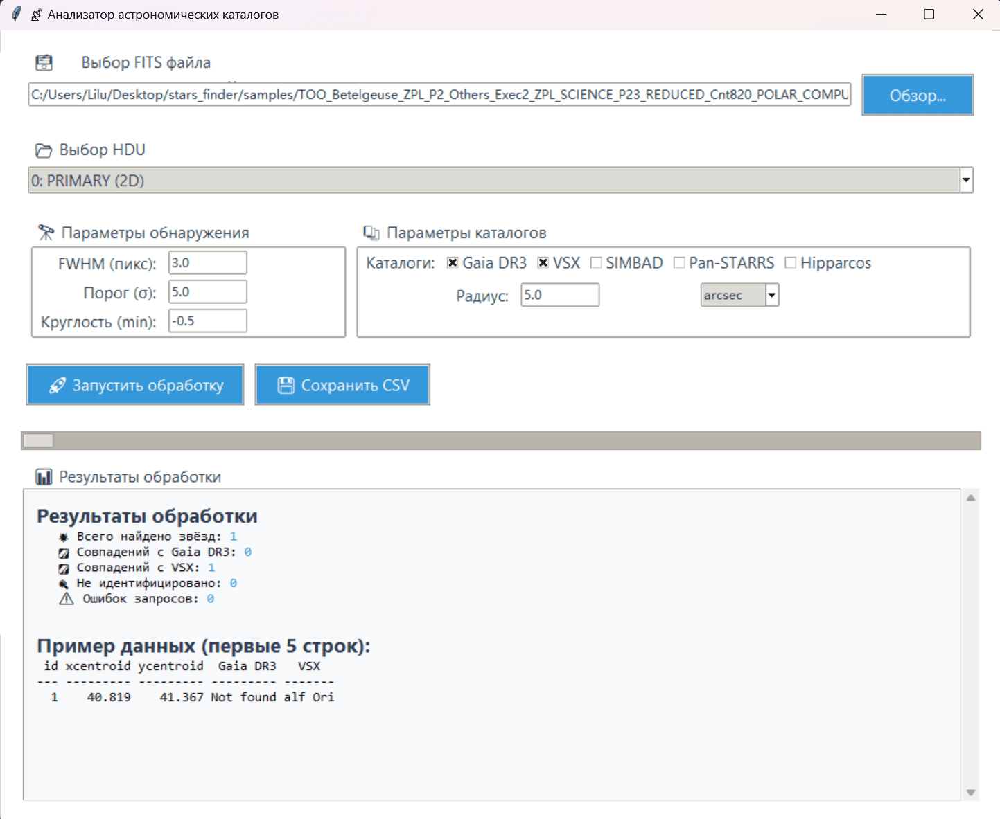

# 📡 Анализатор астрономических каталогов

Приложение для анализа астрономических данных из FITS-файлов с возможностью поиска и сопоставления источников с различными астрономическими каталогами (Gaia DR3, VSX, SIMBAD, Pan-STARRS, Hipparcos).

## Описание

Этот инструмент предоставляет удобный графический интерфейс на базе `tkinter` для обработки астрономических изображений и поиска объектов с заданными параметрами.  
Пользователь может:

- Загружать FITS-файлы и выбирать нужный HDU,
- Настраивать параметры обнаружения (FWHM, порог, круглость),
- Конвертировать координаты пикселей в мировые координаты (WCS)
- Выбирать каталоги для поиска соответствий (Gaia DR3, VSX, SIMBAD, Pan-STARRS, Hipparcos),
- Устанавливать радиус поиска с указанием единиц (arcsec, arcmin, deg),
- Запускать анализ и видеть результаты с подробной статистикой,
- Сохранять результаты в CSV файл.

## Зависимости

```bash
pip install -r requirements.txt
```

## Запуск

Программа поддерживает два режима:

- GUI (графический интерфейс),
- Консольный режим.

Для запуска в GUI режиме:

```bash
python main.py
```

При запуске будет предложено выбрать режим:

```
Выберите режим (1 - GUI, 2 - Консоль): 
```

Введите `1` для графического интерфейса или `2` для консольного.

## Использование

1. В графическом интерфейсе выберите FITS-файл.
2. Выберите HDU из списка.
3. Установите параметры обнаружения звезд (FWHM, порог, круглость).
4. Отметьте каталоги, в которых хотите искать совпадения.
5. Установите радиус поиска и единицы измерения.
6. Нажмите "🚀 Запустить обработку".
7. По окончании обработки вы увидите статистику и часть таблицы с результатами.
8. Можно сохранить результаты в CSV.

## Примечания

- Важна корректная подготовка FITS-файлов с валидным WCS,
- Для некоторых каталогов может потребоваться интернет-соединение,
- Параметры обнаружения влияют на качество и количество найденных источников,
- Количество выбранных каталогов влияет на премя работы программы.


## Пример использования (консоль)

```plaintext
Введите путь к FITS файлу: example.fits

Структура файла:
Filename: example.fits
No.    Name      Ver    Type      Cards   Dimensions   Format
  0  PRIMARY       1 PrimaryHDU     138   (1024, 1024)   float32   

Введите номер (№) HDU для анализа: 0

Введите полуширину главной оси ядра Гаусса в единицах пикселей (fwhm) [по умолчанию: 3.0]: 
Введите пороговое значение (threshold) [по умолчанию: 5.0]:
Введите нижний порог круглости звезды (roundlo), [по умолчанию: -0.5]:
Введите радиус поиска звёзд в каталогах [по умолчанию: 5.0 arcsec]:

Доступные каталоги для проверки:
1. Gaia DR3
2. VSX
3. SIMBAD
4. Pan-STARRS
5. Hipparcos

Введите номера каталогов через запятую (например '1,2,3')

Обработка началась. Ожидайте...

Первые 5 строк полученной таблицы:
   id    xcentroid  ycentroid   ...   Gaia DR3       VSX          SIMBAD      
           pix        pix       ...                              
----- ------------ ----------   ... ------------ ------------ ------------
    1   123.456789  234.567890  ... 123456789012 Not found    Star123     
    2   345.678901  456.789012  ... Not found    VarStar456   Not found   

          Статистика           Количество
------------------------------ ----------
           Всего найдено звёзд          2

                 Найдено в VSX          1
                 Найдено в SIMBAD       1
Не найдено ни в одном каталоге          0
         Ошибок при выполнении          0

Сохранить таблицу? (1 - Да, 0 - Нет): 1
Результаты сохранены в results_example.csv
```

## Пример использования (GUI)
